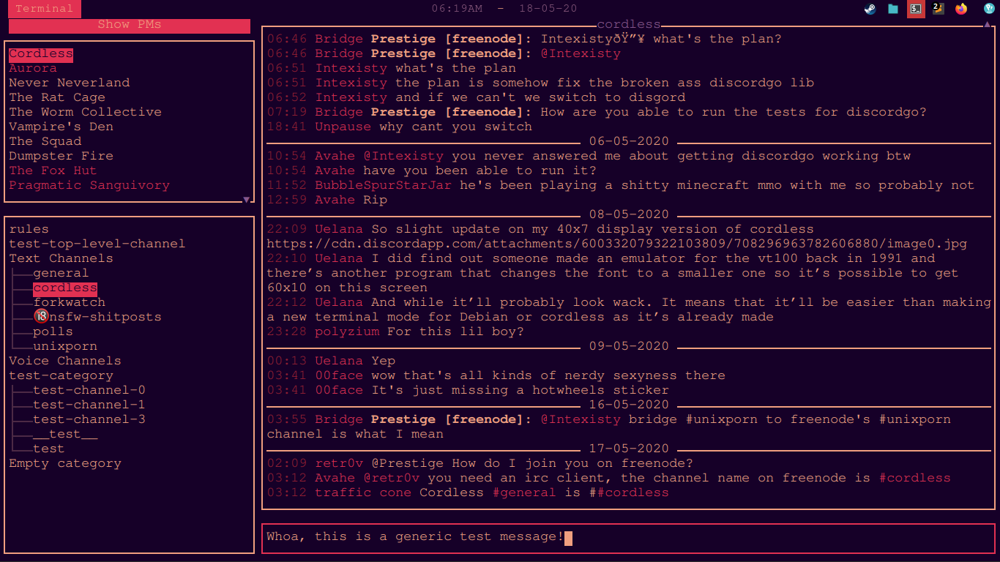
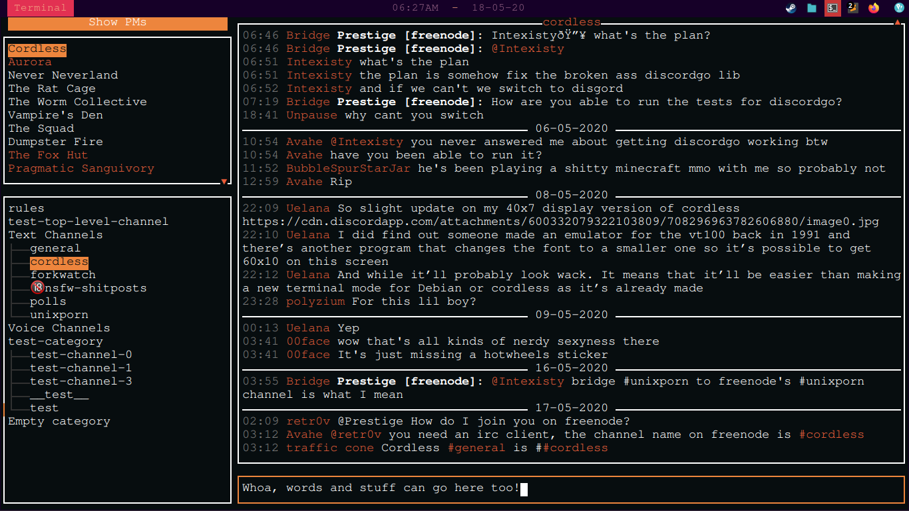

# The Rats Config Stuff
Are you me? No? Proceed anyways, but be warned this is not well made at all. It's a dumping ground of half-baked projects and ideas, and I don't explicitly support anything here. (as in, you *can* ask for help, but I'm not obligating myself to help)

## Cordless
Theme files for Cordless, a CLI Discord interface. Making your own is hard and complicated, so here are some I've made that I liked.

### Sleepy Fuchsia

Easy on the eyes, has peach on dark purple text, and fuchsia accents.
### Spooky Orange

Funky and only a little dated, has white on black text and orange accents.

## How to use
1. Make sure you have  installed. That's kind of important.
2. Replace your theme.json (usually in .config/cordless/) with one of mine.
